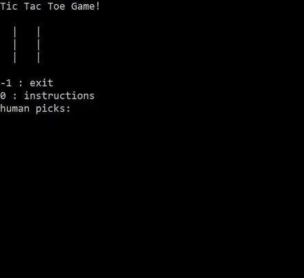

# Tic Tac Toe Console Game

This is a simple tic tac toe console game made in C++17. At least, I hope I made it in C++17. I used smart pointers in a not very smart way, but it should be okay. The numbers on the board correspond ot the numbers on your keyboardz, so:

1 | 2 | 3 
4 | 5 | 6 
7 | 8 | 9

This implements the minimax algorithm for the enemy AI. If the enemy can win, it will do so. It won't lose. It can never lose to a human. Humans are inferior to this AI. DO YOU KNOW WHO THIS AI IS??? I don't. I try not to know. For once I know who the cpu is, I will no longer be what I believe I am. A human. A human traversing through ominously to what humans call Urth. 

Here's a gif to demonstrate the game.

